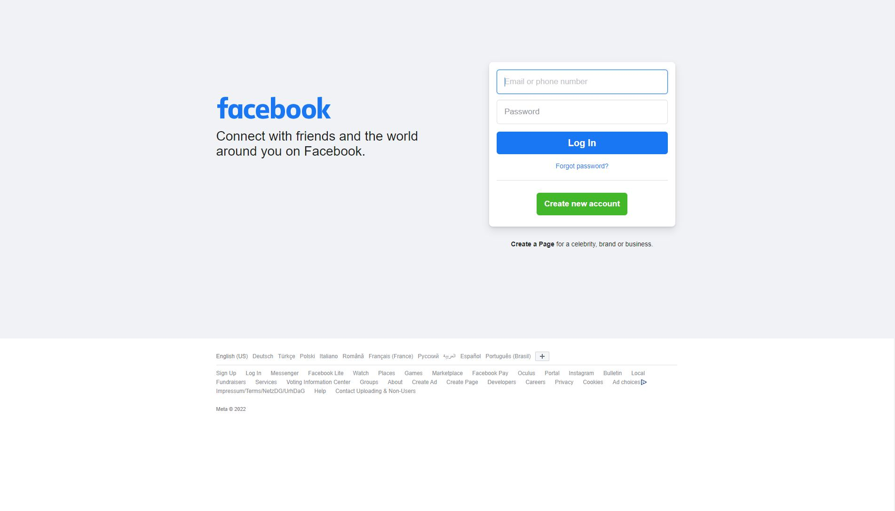

# React-challenges
React challenges from beginner to advance level

## Task number 1
Display "React is cool" as heading 1 and display "For small project React looks like a lot of work but React true power is shown in big projects." as paragraph.  

## Task number 2
Display array of users to browser. a) Make a Users component and use that component inside App component. b) make an array of users objects. such that const users = [{name:'Simon', id:1},{name:'Andre',id:2}, ....] and use this array as data source. 

## Task number 3
Show and Hide Element on Screen with button click. Description: Create a clickable button and 200 by 200 px Box. When button is clicked show the box and when clicked again then hide the box. If box is shown the text on button should be "hide the box" if box is hidden then text on button should be "show the box"

## Task number 4
User input's to be displayed live as being typed. Description: Create input element. As user types in anything in input element, the output of user's input should be displayed in a div below input. Like Realtime output of input.

## Task number 5
Make button disable where there is no character in input field. Enable the button when there is at least one character.

## Task number 6
Create two components: once parent component and one child component. Change the content or text of Parent component by a button inside child component. Child component should be called inside parent component. <App /> can be used as parent component if required.

## Task number 7
Pass Child component as children of Parent Component. 

## Task number 8
Take two numbers as input and add them and show result on button click.

## Task number 9
Create increment and decrement counter

## Task number 10
fetch data from API https://jsonplaceholder.typicode.com/users/1 and display data in browser. you can use fetch or axios with async await or thenables.

## ***************************LEVEL INCREASES********************************

## Task number 11
Import and render the following images 

## Task number 12
Use h1, h3, input and button HTML elements to create the following design using JSX. you may use components and improvise and add features as you like as long as the output looks alike

## Task number 13
Design the following user card

## Task number 14
In the design below, evens are green, odds are yellow and prime numbers are red. Build the following colors using react components and props drilling. Colors can be of your choice as well.

## Task number 15
Make the following bar group using the given data 
const tenHighestPopulation = [
  { country: 'World', population: 7693165599 },
  { country: 'China', population: 1377422166 },
  { country: 'India', population: 1295210000 },
  { country: 'United States of America', population: 323947000 },
  { country: 'Indonesia', population: 258705000 },
  { country: 'Brazil', population: 206135893 },
  { country: 'Pakistan', population: 194125062 },
  { country: 'Nigeria', population: 186988000 },
  { country: 'Bangladesh', population: 161006790 },
  { country: 'Russian Federation', population: 146599183 },
  { country: 'Japan', population: 126960000 },
]

## Task number 16
Use React State to change the background of the page and font color. Can be used to apply dark mode on the page

## Task number 17
Dare to travel random! Use the given countries.js file for data, change the country flag and facts on button click. At best make a card in the middle of the page with button. as show in the below image.

## Task number 18
Fetch data and set loading component to show as long data loads.

## Task number 19
Build a simple portfolio website with light and dark mode. You can choose anyone's portfolio website or can come up with your own idea but it should be simple because we still need to learn more skills to develop full high scale website.

## Task number 20
Build a form like in the picture below. Form should be validated on client's end without using any library. 
i. Fullname cannot be less than 3 character
ii. Email Address should be valid
iii. Password length must be greater than 8 digits
iv. Card number should be greater than 10 digit

## Task number 21 
Redo Task 20 but using useRef and without validation. Just get the input values and display on console without re rendering (which occurs due to useState hook)

## Task number 22
Build facebook sign up clone page and add css modules files next to each component.

## Task number 23
Axios is a JavaScript library which can make HTTP requests to fetch data. Use axios to fetch data from https://jsonplaceholder.typicode.com/ and perform GET POST PUT and DELETE operations using AXIOS. CRUD!

## Task number 24
Built News Website using class components instead of functional components. Use any free news API to fetch updated news and improvise to make the best news website possible. Get ideas from BBC news or any other news channel of your choice.

## Task number 25 
Learn about state management in React and implement Redux state management in a short project

